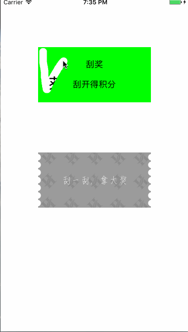

# PGScratchView 1.0.0
###1.实现了什么功能
* !!! ---- 目前iPhone7和iPhone7Plus存在bug
* 目的:刮奖，适用于电商类项目
* 特点:1.支持图片覆盖刮奖；2.支持自定义view覆盖刮奖; 3.自动撤销遮罩层

###2.版本信息
#####Version 1.0.0:

 * 支持图片覆盖刮奖；
 * 支持自定义view覆盖刮奖；
 * 自动撤销遮罩层。

**具体含义请看源代码, 如发现bug请联系:799573715@qq.com (2016-10-23)**
***
###3.动画效果

###4.功能介绍
	/**
 	*  路径宽度，默认为10.0
 	*/
	@property (nonatomic, assign) float sizeBrush;

	/**
	 *  经过多少块撤销图层，默认为10.0，最大为16
	 */
	@property (nonatomic, assign) int passCount;
	
	/**
	 *  设置覆盖在上的图层view
	 */
	- (void)setHideView:(UIView *)hideView;
	
**代理方法的使用**

    /**
     * 打开全部图层之后的代理方法
	  */
	- (void)openAllCoverScratchView:(PGScratchView 	*)scratchView;

###5.代码示例
     _imageScratchView = [[PGScratchView alloc] initWithFrame:CGRectMake(75, CGRectGetMaxY(self.customeScratchView.frame) + 100, 225, 110)];
     _imageScratchView.scratchViewDelegate = self;
     _imageScratchView.sizeBrush = 20.0;
     
     /*用图片作为刮奖view*/
    [self.imageScratchView setHideView:self.coverImageView];
    [self.view addSubview:self.imageScratchView];
**具体含义请看源代码, Designed By Page,QQ:799573715 **
